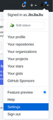
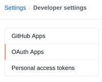
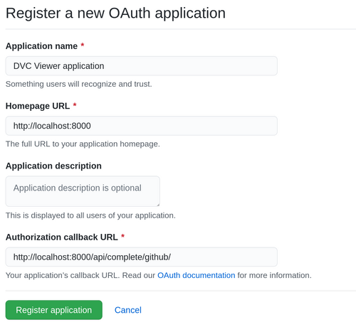

# Github OAuth

For being able to login and use DVC Viewer service you must to create your [own Github OAuth application](https://developer.github.com/apps/building-oauth-apps/creating-an-oauth-app/)

## Steps

* Open settings  
  
* Select **Developer settings** -> **OAuth Apps**  
  
* Fill up the form where  
  **Homepage URL** is your **UI_URL**  
  **Authorization URL** is your **API_URL/complete/github/**  
  
* Register application and use  
  **Client ID** as **GITHUB_CLIENT_ID**  
  **Client Secret** as **GITHUB_SECRET_KEY**
